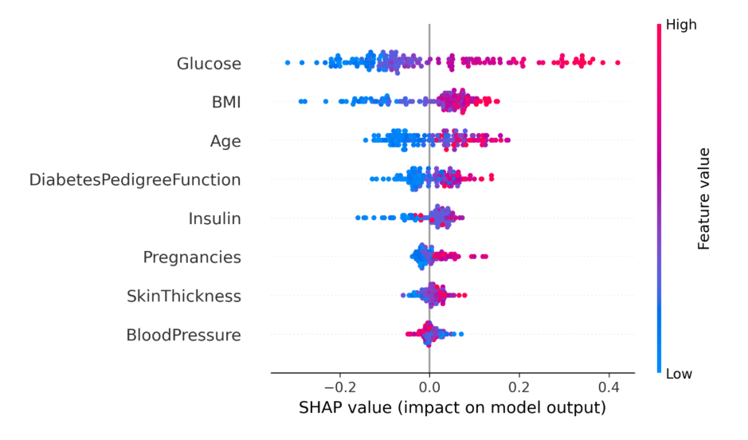

# diabetes-insight-streamlit
## Diabetes Prediction Dashboard

A full-cycle machine learning dashboard that predicts diabetes using clinical data. It combines data analysis, predictive modeling, and explainability through SHAP — all wrapped in a user-friendly Streamlit interface.

---

## Project Structure

```
diabetes-prediction-dashboard/
├── README.md                  # Project overview & documentation
├── diabetes_dashboard.py      # Streamlit dashboard file
├── requirements.txt           # Python dependencies
├── data/
│   └── diabetes.csv           # Dataset
├── images/
│   ├── confusion_matrix.png 
│   └── shap_summary.png
```

---

## Dataset

- **Source**: [Kaggle – Pima Indians Diabetes Database](https://www.kaggle.com/datasets/uciml/pima-indians-diabetes-database)
- **Instances**: 768 patients
- **Features**: 8 predictors (Glucose, BMI, Age, etc.)
- **Target**: Outcome (0 = Non-diabetic, 1 = Diabetic)

---

## Features

✅ Upload CSV to explore data  
✅ Clean missing values with medians  
✅ View distributions (Age, BMI, Outcome)  
✅ Train Random Forest model  
✅ View Confusion Matrix & Classification Report  
✅ Visualize SHAP Summary Plot to explain predictions

---

## Key Insights

- **Glucose** is the strongest predictor — high values are highly associated with diabetes
- **BMI** and **Age** also contribute significantly
- Using **Random Forest**, we achieved:

| Metric       | Value |
|--------------|--------|
| Accuracy     | 0.75   |
| Recall (1)   | 0.67   |
| Precision (1)| 0.64   |
| F1-score (1) | 0.65   |

 Focused on reducing false negatives (missed real diabetic cases)

---

##📈 SHAP Summary Plot

> SHAP helps explain model decisions by showing how each feature pushes a prediction toward 0 or 1.



---

##  How to Run

### 1. Install dependencies
```bash
pip install -r requirements.txt
```

### 2. Run the dashboard
```bash
streamlit run diabetes_dashboard.py
```

Then upload the `diabetes.csv` file when prompted.

---
